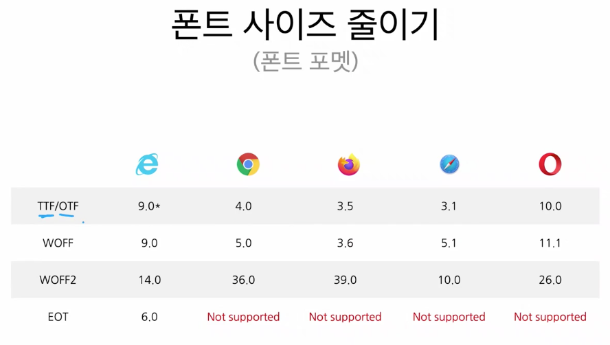
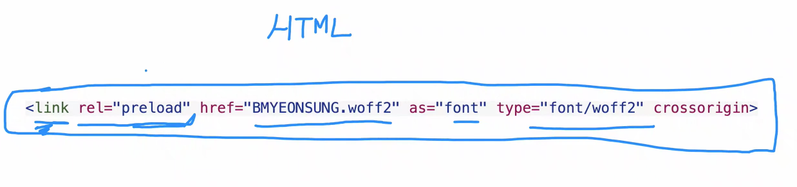
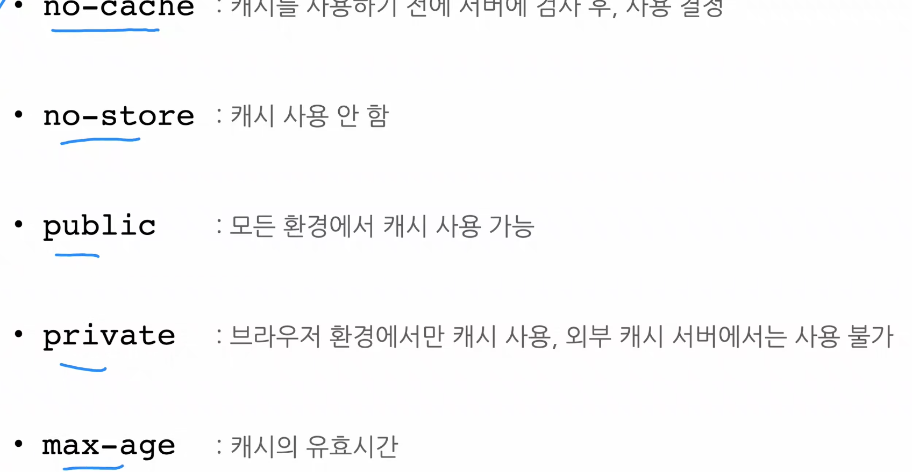
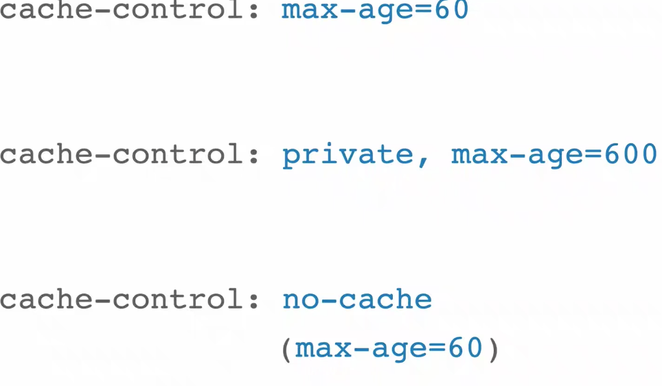
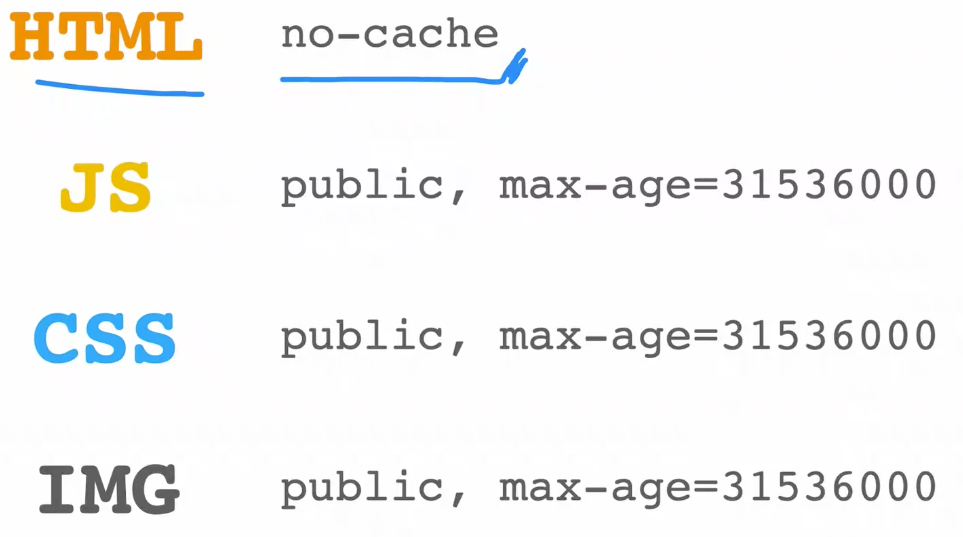

### 2. video 최적화
변환 사이트 : https://www.media.io/

### 3. Font 최적화

1) FOUT : Flash of Unstyled Text
   1) 다운로드가 되기 전 기본 폰트 제공
2) FOIT : 텍스트가 보이지 않다가 다운로드 이후에 폰트 적용
3) 두 가지의 상황을 최소화 하는 것이 목표.
4) 최적화 방법
   #### 1) 순서
      1) 폰트 적용 시점 컨트롤
      2) 폰트 사이즈 줄이기
   #### 2) 폰트 적용 시점 컨트롤
      1) font-display 
         1) auto: 브라우저 기본 동작
         2) block : foit(timeout = 3s)
         3) swap :fout
         4) fallback : foit (0.1s), 3초후에도 불러오지 못했을 경우, 기본 폰트 유지, 이후 캐시
         5) optional : foit (0.1s), 네트워크 상태에 따라, 기본 폰트로 유지할지 웹폰트로 적용할지 결정, 이후 캐시 
      2) 폰트 사이즈 줄이기
         1) 순서
            1) 웹폰트 포멧 사용
            2) 로컬 폰트
            3) subset 
            4) unicode range 
            5) data-uri 변환
            6) preload
         2) 웹폰트 포멧
            
            1) 사이즈 순서 : EOT > TTF/OTF > WOFF > WOFF2
            2) 변환 사이트 : https://transfonter.org/
         3) subset : 실제 사용될 글자들만 추려냄
            
         4) Unicode range
            1) 지정된 유니코드에 대해서만 폰트를 불러오겠다는 설정.
            2) Array.prototype.map.call('ABCDEGIKLMNOPR', c => 'u+' + ('0000') + c.charCodeAt(0).toString(16)).slice(-4).join(','))
         5) data-uri
            1) css 자체에 폰트를 같이 로드 시키는 방법
            2) convert -> base64 encode
               1) `Array.prototype.map.call('ABCDEGIKLMNOPR', c => 'u+' + ('0000') + c.charCodeAt(0).toString(16)).slice(-4).join(',')`
         6) preload
            
            1) npx serve ./build
            2) publick/index.html 에 link 태그 삽입
            3) webpack custom - react rewire 설치
               1) packge.json script 변경
               2) //"start": "npm run build:style && react-scripts start",
                  //"build": "npm run build:style && react-scripts build",
               3) preload-webpack-plugin@3.0.0-beta.3 설치
               4) config-overrides.js > 설정 추가

### 4. 캐시(Cache)
1) 메모리 캐시 : Ram 에 저장
   1) cache-control 로 유효기간을 설정할 수 있다.
   2) server 설정이 필요함.
      
      
      1) no-cache : 캐시 사용 전에 서버 검사 후 사용 결정
         1) no-cashe 는 max-age=0 과 같음.
      2) no-store : 사용안함
      3) public : 모든 환경에서 캐시 사용 가능
      4) private : 브라우저 환경에서만 캐시 사용, 외부 캐시 서버에서는 사용 불가
      5) max-age : 캐시 유효기간
   3) E-tag
      1) 리소스에 대한 해쉬값
      2) 예를 들어 브라우저가 로드할 이미지를 서버에 사용해도 되는지 물어볼 때, 서버에 있는 이미지와 비교한다.
        이 때 리소스의 해쉬값을 가지고 비교하는데, 그 해쉬값이 E-tag 이다.
   4) 리소스 별로 캐쉬를 적용하는 방법
      1) 리소스 사용 구조
         1) HTML - no-cache
         2) JS,CSS - 항상 새로운 데이터를 가지고 와야 함.
            1) max-age = 7D or 1M (무한)
         3) IMG 
      
      2) 
  
          
2) 디스크 캐시 : File 에 저장

